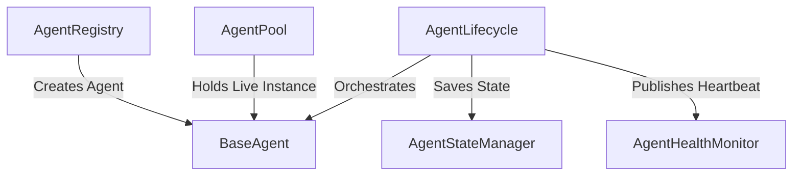

# Agent Health Monitoring Design

This document details the architecture and operational design of the **Agent Health Monitor** for live FieldOps AI agents.

## Purpose
The Agent Health Monitor provides real-time tracking of agent liveness, execution success, latencies, and operational states across all active agent instances.

## Data Separation & Responsibilities
To maintain a strict separation of concerns, the health monitoring system is decoupled from execution, messaging, and storage:
- **AgentRegistry**: Stores definitions, factories, and issues fresh agent instances.
- **AgentPool**: Stores live agent instances currently active in the Python process.
- **AgentLifecycle**: Orchestrates agent setups, runs, teardowns, and safety/timeout boundaries.
- **AgentStateManager**: Persists the current runtime-state snapshot to the database.
- **AgentBus**: Handles asynchronous message passing between agents.
- **AgentHealthMonitor**: Tracks liveness, heartbeat timestamps, and success/failure counters in-memory. It **never** stores live agent instances or business contexts, and completely discards the `metadata` dictionary (setting it to `{}`) upon recording.

## Heartbeat Model
The monitor accepts immutable `AgentHeartbeat` schemas containing:
- `agent_id` (UUID4)
- `tenant_id` (stripped string, max 50 chars)
- `agent_type` (`AITask` enum)
- `state` (`AgentState` enum)
- `observed_at` (timezone-aware datetime)
- `correlation_id` (optional, max 100 chars)
- `result_status` (`AgentResultStatus` enum, or None)
- `latency_ms` (optional, non-negative finite float)
- `safe_error_code` (optional, max 100 chars)
- `metadata` (recursive JSON-safe copy, rejecting sensitive keys)

### Privacy & Metadata Gating
To comply with strict privacy policies:
- Sensitive metadata keys (such as `api_key`, `secret`, `password`, `token`, `auth_token`, `authorization`, `prompt`, `system_prompt`, `provider_response`, `raw_response`, `customer_name`, `customer_address`, `customer_email`, `customer_phone`, `phone_number`, `gps`, `latitude`, `longitude`, `coordinates`, `stack_trace`, `traceback`, `exception`, etc.) are checked case-insensitively and rejected recursively.
- Error messages identify the rejected key path but **never** expose its value.
- Execution payloads, business results, and raw exception text are completely excluded from the heartbeat metadata.
- **Discarded Metadata**: After validating the incoming `AgentHeartbeat` schema, the `AgentHealthMonitor` deep-copies the heartbeat, replaces the `metadata` field with `{}` (empty dictionary), and stores only the metadata-stripped operational heartbeat. This prevents keeping arbitrary customer metadata in memory.

## Lifecycle Heartbeat Points
Heartbeats are safely dispatched by `AgentLifecycle` at the following points:
1. **Initialize success**: State set to `IDLE`, result status is `None`.
2. **Execution start**: State set to `RUNNING`, result status is `None`.
3. **Execution success**: State set to `IDLE`, result status is `SUCCESS`, and latency is captured.
4. **Execution failure**: State set to `ERROR`, result status is `FAILED`, safe error code `AGENT_EXECUTION_FAILED`.
5. **Execution timeout**: State set to `ERROR`, result status is `TIMEOUT`, safe error code `AGENT_EXECUTION_TIMEOUT`.
6. **Teardown**: State set to `TERMINATED`, result status is `None`.

### Log-and-Continue Lifecycle Policy
Health reporting failures must **never** interfere with standard lifecycle operations. Any exceptions raised while validating or storing heartbeats are caught within `AgentLifecycle._record_health`, logged with safe identifiers only, and discarded.

## Health Status Rules
The overall status is dynamically calculated from snapshots:
- **UNKNOWN**: No heartbeat exists for the agent. In a health summary, if there are no tracked agents (total_agents == 0), the status is evaluated as UNKNOWN rather than HEALTHY.
- **UNHEALTHY**:
  - Current state is `ERROR`.
  - Last result status was `FAILED` or `TIMEOUT`.
  - Age (current time - last heartbeat) $\ge$ `unhealthy_after_seconds`.
- **DEGRADED**:
  - Age $\ge$ `degraded_after_seconds` (but not unhealthy).
  - `consecutive_failures` > 0.
  - Current state is `PAUSED`.
- **HEALTHY**:
  - Agent heartbeat is recent, state is not `ERROR`, last result is not a failure/timeout, and consecutive failures count is zero.

### Terminated-Agent Behavior
A `TERMINATED` state indicates a clean and successful agent shutdown, not a failure. A recent terminated heartbeat (age < `degraded_after_seconds`) is marked as `HEALTHY` in the snapshot, preserving the clean shutdown status without raising degraded/unhealthy flags.

## Counter and Latency Behavior
- `total_heartbeats` is incremented on every accepted heartbeat.
- On `SUCCESS`: `total_successes` is incremented, and `consecutive_failures` is reset to 0.
- On `FAILED`: `total_failures` is incremented, and `consecutive_failures` is incremented.
- On `TIMEOUT`: `total_timeouts` is incremented, and `consecutive_failures` is incremented.
- On `None` result status (e.g. initialize, execution start, teardown): Counters and consecutive failures remain unchanged.
- **Bounded Latency**: Latency samples are stored in a bounded `deque` of size `latency_window_size` (between 1 and 1000). The snapshot exposes `last_latency_ms` and `average_latency_ms` (arithmetic mean of active window samples).

## Heartbeat Ordering & Replay Protection
- Heartbeats are keyed by `(tenant_id, agent_id)`.
- If a heartbeat arrives with `observed_at` $\le$ the last seen heartbeat's `observed_at`, it is ignored completely as stale or a duplicate replay. The snapshot remains unchanged, and no counters are updated.

## Tenant Isolation & Safety

- Agent-specific lookup and removal use the compound key
  `(tenant_id, agent_id)`.
- An agent cannot be retrieved or removed using another tenant's ID.
- `clear_tenant()` removes records only for the specified tenant.
- `list_agent_health()`, `summarize()`, and `tracked_count()` support
  an optional tenant filter for internal administrative monitoring.
- When a tenant filter is supplied, it is normalized, stripped,
  non-blank, and limited to 50 characters.
- Tenant-filtered operations never return records belonging to another
  tenant.

## Async Lock Design
The monitor uses an `asyncio.Lock` to protect the internal records map during updates. To prevent lock starvation or starvation of other tasks:
- The clock is evaluated once outside the lock.
- Pydantic models and summaries are constructed and sorted outside the lock using isolated data copies.
- Logging operations are performed outside the lock.

## Boundaries & Limitations
- **In-Memory Storage**: Heartbeat metrics are entirely in-memory and will reset upon application restart.
- **No Automatic Recovery**: The monitor does not perform automatic agent restarts or state reconstructions.
- **No Background Polling**: The monitor does not run background loops to sweep for stale agents; staleness is computed dynamically upon lookup/list request.
- **No HTTP Routes**: No FastAPI `/health` routes, Prometheus exporters, or Redis storage integrations are included in this layer.
- **Agent Migrations**: Remaining agents (Monitoring, Sentiment, Communication, Closure) have not been migrated and are not affected by this story.
