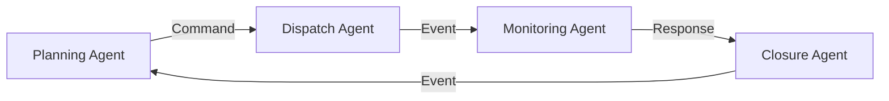

# AI Agent Communication Contract

## Purpose

This document defines the standard communication protocol used between AI agents within the FieldOps Commander AI Runtime.

The goal of this contract is to ensure that every AI agent exchanges information in a consistent, validated, and versioned format.

All inter-agent communication must use the schemas defined in:

```
app/services/ai/FieldOpsAI/schemas/agent_messages.py
```

This contract is transport-independent and can be used with:

- Redis Pub/Sub
- Celery
- Kafka
- RabbitMQ
- HTTP
- gRPC

---

# Design Principles

The communication protocol follows these principles:

- Strongly typed messages
- Schema-first design using Pydantic
- JSON serialization
- Backward compatible versioning
- Transport-independent communication
- Unique message correlation
- Multi-tenant agent addressing

---

# Communication Flow



---

# Message Structure

Every communication between AI agents must be wrapped inside a **MessageEnvelope**.

```
MessageEnvelope
│
├── sender
├── recipient
├── message_type
├── payload
├── timestamp
├── correlation_id
├── contract_version
└── timeout_seconds
```

The payload contains the business-specific data.

The remaining fields provide routing, validation, tracking, and compatibility.

---

# Agent Address

Every AI agent has a unique address.

Format

```
agent_type:agent_id:tenant_id
```

Example

```
planning:planner-01:tenant-001
```

Components

| Field | Description |
|--------|-------------|
| agent_type | Type of AI agent |
| agent_id | Unique agent instance |
| tenant_id | Tenant identifier |

Example addresses

```
planning:planner-01:tenant-001

dispatch:dispatcher-01:tenant-001

monitoring:monitor-01:tenant-001

communication:comm-01:tenant-001
```

---

# Message Types

## COMMAND

Purpose

Request another AI agent to perform an action.

Example

Planning Agent

↓

Dispatch Agent

Assign Technician

---

## QUERY

Purpose

Request information from another AI agent.

Example

Monitoring Agent

↓

Planning Agent

Who is the nearest technician?

---

## EVENT

Purpose

Notify other agents that something has occurred.

Examples

- Technician accepted job
- Technician rejected job
- Customer cancelled request
- Job completed

---

## RESPONSE

Purpose

Return the successful result of a command or query.

Example

Recommended technician returned to Dispatch Agent.

---

## ERROR

Purpose

Return details when processing fails.

Examples

- Technician unavailable
- Invalid request
- Timeout
- AI provider unavailable

---

# JSON Serialization

Messages are serialized using:

- JSON
- UTF-8 encoding
- Pydantic v2 validation

Every message must successfully validate before processing.

Serialization example

```json
{
  "sender": {
    "agent_type": "planning",
    "agent_id": "planner-01",
    "tenant_id": "tenant-001"
  },
  "recipient": {
    "agent_type": "dispatch",
    "agent_id": "dispatcher-01",
    "tenant_id": "tenant-001"
  },
  "message_type": "COMMAND",
  "payload": {
    "job_id": "JOB-1001",
    "technician_id": "TECH-101"
  },
  "timestamp": "2026-07-10T10:30:00Z",
  "correlation_id": "c2c2c9e7-6c34-4fd9-a1ef-b8fd82e03b9c",
  "contract_version": "1.0",
  "timeout_seconds": 5
}
```

---

# Timeout Rules

The AI Runtime follows these timeout rules.

| Communication Type | Timeout |
|--------------------|----------|
| Synchronous Request | 5 seconds |
| Asynchronous Request | 30 seconds |

If a timeout occurs:

- Return an ErrorMessage
- Preserve the correlation ID
- Log the failure
- Do not retry automatically unless configured by the Business Service

---

# Correlation IDs

Every request generates a unique correlation ID.

The same correlation ID is preserved throughout the complete workflow.

Example

```
Planning Agent

↓

Dispatch Agent

↓

Monitoring Agent

↓

Closure Agent
```

Every message in this workflow shares the same correlation ID.

Benefits

- Traceability
- Debugging
- Distributed logging
- Monitoring

---

# Contract Versioning

Current Version

```
1.0
```

Versioning Rules

Minor changes

- Add optional fields
- Documentation updates

Major changes

- Remove fields
- Rename fields
- Modify message semantics

Backward Compatibility

Older agents should continue functioning when optional fields are added.

Breaking changes require a new major contract version.

---

# Validation

Every message is validated using Pydantic before processing.

Validation includes:

- Required fields
- Field types
- Agent address format
- Enum validation
- Timestamp format
- Payload structure

Invalid messages are rejected immediately.

---

# Error Handling

If validation fails

↓

Reject message

↓

Return ErrorMessage

↓

Log validation failure

↓

Stop processing

---

# Future Enhancements

The communication protocol is designed to support future extensions including:

- Message priority
- Retry policies
- Dead-letter queues
- Message expiration
- Distributed tracing
- Digital signatures
- Encryption
- Message compression