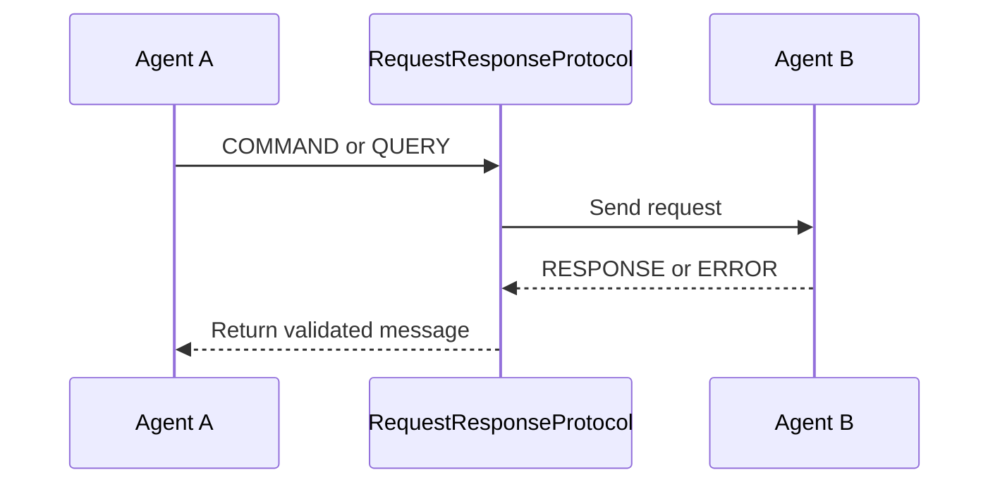
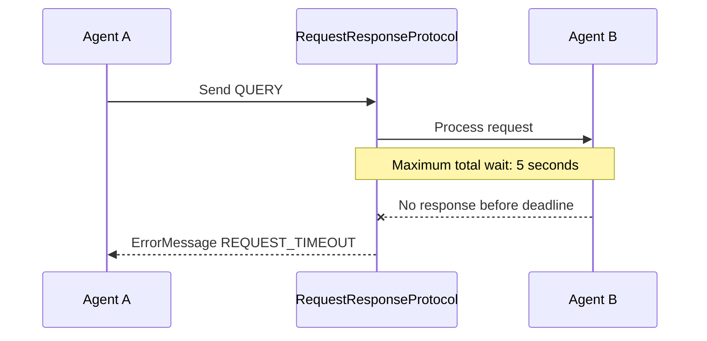
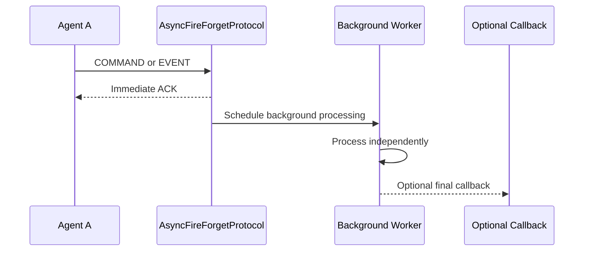
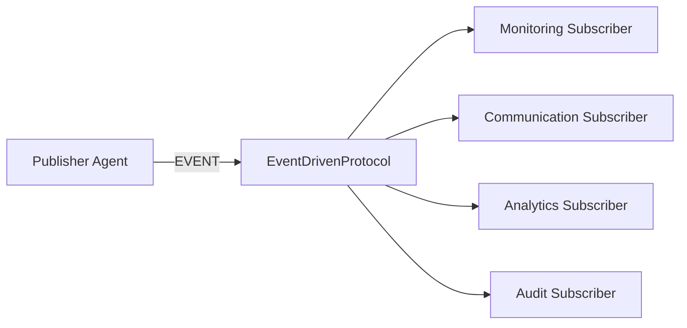

# AI Agent Message Flow Protocols

## Purpose

This document defines the standard message-flow protocols used by FieldOps Commander agents and backend services.

The protocols define how messages are sent, processed, retried, timed out, correlated, and handled when failures occur.

The message schemas used by these protocols are defined in:

```text
app/services/ai/FieldOpsAI/schemas/agent_messages.py
```

The protocol implementations are defined in:

```text
app/core/protocols/
```

---

# Supported Protocols

FieldOps Commander supports three communication protocols:

1. Request/Response
2. Async Fire-and-Forget
3. Event-Driven

Each protocol is intended for a different type of workflow.

| Protocol | Sender waits? | Response expected? | Typical purpose |
|---|---:|---:|---|
| Request/Response | Yes | Yes | Immediate decision or information |
| Async Fire-and-Forget | No | Immediate ACK only | Background processing |
| Event-Driven | No | No | Announce that something happened |

---

# Shared Message Contract

Every protocol uses the standard message envelope defined in:

```text
app/services/ai/FieldOpsAI/schemas/agent_messages.py
```

Every message includes:

```text
sender
recipient
message_type
payload
timestamp
correlation_id
contract_version
timeout_seconds
```

Example:

```json
{
  "sender": {
    "agent_type": "planning",
    "agent_id": "planner-01",
    "tenant_id": "tenant-001"
  },
  "recipient": {
    "agent_type": "dispatch",
    "agent_id": "dispatcher-01",
    "tenant_id": "tenant-001"
  },
  "message_type": "QUERY",
  "payload": {
    "job_id": "JOB-1001"
  },
  "timestamp": "2026-07-11T10:30:00Z",
  "correlation_id": "d6338735-1e21-4fa3-9386-03677e772607",
  "contract_version": "1.0",
  "timeout_seconds": 5
}
```

---

# Correlation ID Rules

Every message must contain a correlation ID.

The correlation ID is used to track one business workflow across multiple agents, services, callbacks, and events.

Example:

```text
Planning Agent
      ↓
Dispatch Agent
      ↓
Monitoring Agent
      ↓
Closure Agent
```

Every message belonging to that workflow must preserve the same correlation ID.

Example:

```text
d6338735-1e21-4fa3-9386-03677e772607
```

## Correlation ID requirements

- A new workflow generates one correlation ID.
- A response must use the request correlation ID.
- An asynchronous callback must use the original message correlation ID.
- Every event subscriber receives the original correlation ID.
- Error messages must preserve the failed message correlation ID.
- Retry attempts must not generate a new correlation ID.

This enables:

- Distributed logging
- Request tracing
- Debugging
- Error investigation
- Performance monitoring
- Audit history

---

# Retry Policy

All retryable protocol operations use exponential backoff.

The configured retry delays are:

```text
1 second
2 seconds
4 seconds
```

The implementation performs:

```text
Initial attempt
      ↓ failure
Wait 1 second
      ↓
Retry 1
      ↓ failure
Wait 2 seconds
      ↓
Retry 2
      ↓ failure
Wait 4 seconds
      ↓
Retry 3
```

Therefore, a retryable operation may execute up to four times:

```text
1 initial attempt + 3 retries
```

## Retryable failures

Retries are appropriate for temporary failures such as:

- Temporary network failure
- Redis connection interruption
- Worker temporarily unavailable
- Transient database connection failure
- Temporary downstream-service failure

## Non-retryable failures

Retries should not normally be used for permanent validation failures such as:

- Invalid message schema
- Unsupported message type
- Missing required payload field
- Invalid agent address
- Unauthorized tenant access

## Cancellation behavior

`asyncio.CancelledError` is never retried.

Cancellation usually means:

- The application is shutting down.
- A worker is being stopped.
- The task was explicitly cancelled.

Cancellation must propagate immediately.

---

# Timeout Matrix

| Protocol | Maximum timeout | Behavior |
|---|---:|---|
| Request/Response | 5 seconds | Return an `ErrorMessage` |
| Async Fire-and-Forget | 30 seconds | Route failure to dead-letter handling |
| Event-Driven | No protocol timeout | Subscriber failure is logged and dropped |

A message may request a shorter timeout through:

```text
timeout_seconds
```

A message cannot increase the protocol maximum.

Example:

```text
Request/Response protocol maximum: 5 seconds
Message requested timeout: 3 seconds
Applied timeout: 3 seconds
```

Example:

```text
Request/Response protocol maximum: 5 seconds
Message requested timeout: 10 seconds
Applied timeout: 5 seconds
```

---

# Error Propagation Matrix

| Protocol | Error behavior |
|---|---|
| Request/Response | Return `ErrorMessage` to the original sender |
| Async Fire-and-Forget | Log failure and route it to the dead-letter queue |
| Event-Driven | Log subscriber failure and drop that delivery silently |

All errors must preserve the original correlation ID.

---

# 1. Request/Response Protocol

## Purpose

The Request/Response protocol is used when one agent needs an immediate result from another agent.

The sender waits for either:

- A successful response
- An error response
- A timeout error

The maximum total waiting time is five seconds.

## Flow



## Timeout flow



## Accepted message types

The protocol accepts:

```text
COMMAND
QUERY
```

The receiving handler must return:

```text
RESPONSE
ERROR
```

## Example use cases

- Planning Agent requests technician availability.
- Dispatch Agent requests a reassignment recommendation.
- Monitoring Agent requests immediate escalation guidance.
- Closure Agent requests job information required for a summary.
- Communication Agent requests sentiment information before generating a response.

## Success behavior

The response is validated as a `BaseMessage`.

The response must be either:

```text
ResponseMessage
ErrorMessage
```

The protocol ensures that the response correlation ID matches the original request correlation ID.

## Timeout behavior

If the operation exceeds five seconds, the caller receives:

```json
{
  "message_type": "ERROR",
  "error_code": "REQUEST_TIMEOUT",
  "error_message": "The request did not complete within 5 seconds."
}
```

## Processing failure behavior

If processing fails after retries, the caller receives:

```json
{
  "message_type": "ERROR",
  "error_code": "REQUEST_FAILED",
  "error_message": "The synchronous request could not be completed."
}
```

## Example usage

```python
from app.core.protocols import RequestResponseProtocol


protocol = RequestResponseProtocol()

response = await protocol.execute(
    message=request_message,
    handler=recipient_handler,
)
```

---

# 2. Async Fire-and-Forget Protocol

## Purpose

The Async Fire-and-Forget protocol is used when the sender does not need to wait for the complete operation.

The sender receives an immediate acknowledgement.

The actual processing continues independently.

## Flow



## ACK meaning

The ACK means:

```text
The message was accepted and scheduled for processing.
```

The ACK does not mean:

```text
The operation completed successfully.
```

Example ACK payload:

```json
{
  "status": "ACK",
  "accepted": true,
  "processing": "BACKGROUND",
  "protocol": "async_fire_and_forget",
  "callback_timeout_seconds": 30,
  "original_message_type": "COMMAND"
}
```

## Accepted message types

The protocol accepts:

```text
COMMAND
EVENT
```

The background handler may return:

```text
ResponseMessage
ErrorMessage
None
```

When the handler returns `None`, the protocol creates a successful completion response internally.

## Example use cases

- Generate and send a customer notification.
- Run customer sentiment analysis.
- Generate a closure summary.
- Store an audit record.
- Submit a report-generation job.
- Send an email, SMS, or push notification.
- Trigger a long-running workflow.

## Timeout behavior

Background processing and its optional callback have a maximum combined timeout of 30 seconds.

A message may request a shorter timeout.

A message cannot increase the maximum beyond 30 seconds.

## Failure behavior

When background processing fails:

```text
Retry processing
      ↓
Retries exhausted
      ↓
Create ErrorMessage
      ↓
Log the failure
      ↓
Send to dead-letter handling
```

The failure is not returned to the original sender because the sender already received the ACK.

## Dead-letter queue

A dead-letter queue stores messages that could not be processed successfully.

It allows developers or recovery workers to:

- Inspect failed messages
- Investigate errors
- Retry messages manually
- Replay messages after fixing a problem
- Preserve failed work across restarts

Recommended production transports include:

- Redis Streams
- Celery failure queues
- RabbitMQ dead-letter exchanges
- Kafka dead-letter topics

## Example usage

```python
from app.core.protocols import AsyncFireForgetProtocol


protocol = AsyncFireForgetProtocol(
    dead_letter_publisher=publish_dead_letter,
)

ack = await protocol.execute(
    message=command_message,
    handler=background_handler,
    callback=result_callback,
)
```

## Production durability

The protocol implementation may use `asyncio.create_task()` for:

- Local development
- Unit tests
- Integration tests
- Short-lived in-process operations

Durable production jobs should be submitted to:

```text
Celery
Redis Streams
another persistent worker queue
```

An in-process task can be lost if the FastAPI server restarts.

---

# 3. Event-Driven Protocol

## Purpose

The Event-Driven protocol is used to announce that something has happened.

One publisher sends an event.

Multiple subscribers can receive and process that event independently.

No business response is expected.

## Flow



## Accepted message type

The protocol accepts only:

```text
EVENT
```

Subscribers return:

```text
None
```

## Example events

- `TECHNICIAN_ACCEPTED`
- `TECHNICIAN_REJECTED`
- `TECHNICIAN_ENROUTE`
- `TECHNICIAN_ONSITE`
- `JOB_COMPLETED`
- `JOB_CANCELLED`
- `CUSTOMER_MESSAGE_RECEIVED`
- `GPS_POSITION_UPDATED`

## Example use case

```text
Dispatch Agent publishes TECHNICIAN_ACCEPTED
          │
          ├── Monitoring starts tracking
          ├── Communication sends customer notification
          ├── Analytics records acceptance time
          └── Audit service stores the event
```

## Subscriber isolation

Every subscriber processes the event independently.

A failure in one subscriber must not stop other subscribers.

Example:

```text
Monitoring subscriber       succeeds
Communication subscriber    fails
Analytics subscriber        succeeds
Audit subscriber            succeeds
```

The successful subscribers remain unaffected.

## Retry behavior

Each subscriber delivery receives its own retry sequence.

```text
Initial delivery
      ↓ failure
Wait 1 second
      ↓
Retry 1
      ↓ failure
Wait 2 seconds
      ↓
Retry 2
      ↓ failure
Wait 4 seconds
      ↓
Retry 3
```

## Failure behavior

When a subscriber still fails after retries:

- Log the failure.
- Include the correlation ID.
- Drop that subscriber delivery.
- Do not return an error to the publisher.
- Do not stop other subscribers.

This behavior is referred to as:

```text
log and drop silently
```

“Silently” means the exception does not propagate back to the publisher. The failure must still be logged.

## Timeout behavior

Events have no protocol timeout.

The publisher does not wait for a response.

With Redis Streams, publication should normally mean writing the event to the stream. Subscribers consume the event independently.

## Example usage

```python
from app.core.protocols import EventDrivenProtocol


protocol = EventDrivenProtocol()

protocol.subscribe(
    name="monitoring",
    subscriber=monitoring_subscriber,
)

protocol.subscribe(
    name="communication",
    subscriber=communication_subscriber,
)

await protocol.execute(
    event_message
)
```

---

# Protocol Selection Guide

Use Request/Response when:

```text
The sender cannot continue without the result.
```

Example:

```text
Dispatch Agent needs an immediate planning recommendation.
```

Use Async Fire-and-Forget when:

```text
The sender only needs confirmation that work was accepted.
```

Example:

```text
Submit a customer email for background generation and delivery.
```

Use Event-Driven when:

```text
Something happened and multiple independent systems may care.
```

Example:

```text
A technician completed a job.
```

---

# Backend Integration

## FastAPI

FastAPI routes may use Request/Response when an immediate result is required.

Example:

```text
FastAPI Route
      ↓
Business Service
      ↓
RequestResponseProtocol
      ↓
Agent
      ↓
API Response
```

FastAPI routes should use Async Fire-and-Forget for background work when the client does not require the complete result.

Example:

```text
FastAPI Route
      ↓
Submit background work
      ↓
Return HTTP response
```

---

## Celery

Celery is recommended for durable async processing.

Example:

```text
AsyncFireForgetProtocol
      ↓
Celery task submitted
      ↓
Immediate ACK
      ↓
Celery worker processes task
```

Celery should be used when work must survive:

- FastAPI restarts
- Worker restarts
- Temporary service interruption
- Deployment changes

---

## Redis Streams

Redis Streams is recommended for durable event-driven workflows.

Example:

```text
Publisher
      ↓
Redis Stream
      ├── Monitoring consumer group
      ├── Communication consumer group
      └── Analytics consumer group
```

Redis Streams provides:

- Persistent event storage
- Consumer groups
- Message replay
- Delivery tracking
- Pending-message recovery

---

## Redis Pub/Sub

Redis Pub/Sub may be used for temporary real-time events.

However, Pub/Sub messages are not durable.

If a subscriber is disconnected, it may miss the event.

Use Redis Streams when delivery reliability is required.

---

# Graceful Degradation

Graceful degradation means the system fails in a controlled and predictable way.

## Request/Response

```text
Failure
   ↓
Return ErrorMessage
```

## Async Fire-and-Forget

```text
Failure
   ↓
Log
   ↓
Dead-letter queue
```

## Event-Driven

```text
Subscriber failure
   ↓
Log
   ↓
Drop failed subscriber delivery
   ↓
Other subscribers continue
```

Raw transport exceptions should not escape into unrelated business workflows.

---

# Logging Requirements

Every protocol log should include:

```text
protocol_name
message_type
sender
recipient
correlation_id
retry_number
timeout_seconds
error_type
```

Example:

```text
[request_response] SEND
sender=planning:planner-01:tenant-001
recipient=dispatch:dispatcher-01:tenant-001
correlation_id=d6338735-1e21-4fa3-9386-03677e772607
```

Retry example:

```text
[request_response] RETRY
retry=1/3
delay=1.0s
correlation_id=d6338735-1e21-4fa3-9386-03677e772607
```

Timeout example:

```text
[request_response] TIMEOUT
timeout=5.0
correlation_id=d6338735-1e21-4fa3-9386-03677e772607
```

---

# Validation Rules

Before protocol processing begins:

- The message must be a validated `BaseMessage`.
- The message type must be supported by the selected protocol.
- The handler must be callable.
- Subscriber names must be non-empty.
- Timeout values must be greater than zero or `None`.
- The correlation ID must be present.
- Responses and errors must use the original correlation ID.

Invalid messages must be rejected before transport processing begins.

---

# Testing Requirements

The following integration tests are required.

## Request/Response tests

- Successful response completes within five seconds.
- Timeout returns an `ErrorMessage`.
- Handler exception triggers retry behavior.
- Retry exhaustion returns `REQUEST_FAILED`.
- Response preserves the request correlation ID.
- Invalid message types are rejected.

## Async Fire-and-Forget tests

- ACK is returned immediately.
- Background processing continues after ACK.
- Callback receives the final result.
- Handler failure triggers retries.
- Processing timeout creates an error.
- Failed processing reaches dead-letter handling.
- Callback preserves the original correlation ID.

## Event-Driven tests

- Every subscriber receives the event.
- Subscribers receive the same correlation ID.
- Subscribers run independently.
- One failing subscriber does not stop others.
- Failed subscriber delivery is retried.
- Failure is logged and dropped after retries.
- Non-event messages are rejected.

## Test retry delays

Production retry delays are:

```text
1 second
2 seconds
4 seconds
```

Tests should override them with shorter delays:

```python
RETRY_DELAYS = (
    0.01,
    0.02,
    0.04,
)
```

This verifies retry behavior without slowing down the test suite.

---

# Source Files

```text
app/core/protocols/
├── __init__.py
├── base_protocol.py
├── retry.py
├── timeout.py
├── request_response.py
├── async_fire_forget.py
└── event_driven.py
```

Message schemas:

```text
app/services/ai/FieldOpsAI/schemas/agent_messages.py
```

Protocol tests:

```text
tests/test_message_protocols.py
```

---

# Future Enhancements

The protocol layer can later support:

- Distributed tracing
- OpenTelemetry integration
- Message priority
- Message expiration
- Idempotency keys
- Circuit breakers
- Bulk event publishing
- Dead-letter replay workers
- Redis consumer-group recovery
- Celery task result backends
- Message encryption
- Digital signatures
- Tenant-specific retry policies